# DhuanAlert Technical Audit Report
**Physics-Based Smoke Modeling, Geospatial/ML Pipeline & Frontend Systems**

---

> [!WARNING]
> **Executive Verdict: Mostly Scaffolding with Decoupled, Decorative Placeholders**  
> While the repository contains clean Pydantic type definitions and an isolated 2D particle integration loop, the system is fundamentally decoupled from the frontend, relies on synthetic noise for its visual outputs, and evaluates itself using fabricated test fixtures masquerading as historical backtests.

---

## 1. Executive Summary

DhuanAlert claims to predict smoke and AQI spread over Delhi-NCR using a hybrid Lagrangian particle dispersion engine, satellite fire clustering, and meteorological forecasts. In reality:

1. **The frontend does not render simulated smoke.** Following commit `be67ba8`, [App.tsx](file:///c:/dev/yegareebkimkc/wemakedevs/frontend/src/App.tsx) was stripped down to render only [LiveMap.tsx](file:///c:/dev/yegareebkimkc/wemakedevs/frontend/src/components/LiveMap.tsx), which displays raw NASA FIRMS satellite fire detections and zero model output.
2. **Timeline slices and heatmaps bypass the physics engine.** The hourly animation slices in `PredictiveOutput` are not produced by the Lagrangian simulation. They are hardcoded axis-aligned rectangles and synthetic Gaussian scatter dots generated along a straight-line advection vector using `np.random.seed(42 + h)`.
3. **Multi-horizon chaining does not exist.** The model runs for a single fixed 6-hour horizon. Intermediate states are discarded; +3h, +6h, and +9h states are neither chained nor carried forward.
4. **Atmospheric transport lacks physical variation.** Wind is treated as temporally constant (only index 0 of the forecast is read), vertical particle height ($z$) is ignored, and boundary-layer height (BLH) is mapped to an inverted horizontal diffusion formula.
5. **The evaluation matrix is fabricated.** Every forecast run executes `run_evaluation_demo()` imported from the unit tests, calculating metrics on 12 synthetic step-function values while labeling the output as a historical retrospective study across Delhi CAAQMS stations.

---

## 2. Architecture Map: Claimed vs. Actual Data Flow

```mermaid
flowchart TD
    subgraph Claimed ["Intended Architecture"]
        F1["NASA FIRMS Live Hotspots"] --> C1["FRP-Based Biomass Emission Rate (kg/s)"]
        W1["Open-Meteo GFS 4D Vector Field u,v,BLH(x,y,t)"] --> L1["3D Lagrangian Particle Engine"]
        C1 --> L1
        L1 --> CH1["State Chaining: +3h -> +6h -> +9h"]
        CH1 --> G1["Continuous 2D Concentration Field KDE"]
        G1 --> P1["FrontendPayload: Hourly Plume Contours"]
        P1 --> UI1["Interactive Animated Heatmap (PlumeMap.tsx)"]
    end

    subgraph Actual ["Actual Reality"]
        F2["NASA FIRMS API or sample_fires.json"] --> C2["FireSourceModel: 1-Hop Cluster & Invented Proxy [0.05..1.0]"]
        W2["Open-Meteo or sample_weather.json"] -->|Only index 0 used| L2["2D Lagrangian Engine: Constant Wind, z=0"]
        C2 --> L2
        L2 -->|Runs 24 steps to +6h; drops intermediate steps| D2["Final Particles at t=6h Only"]
        D2 -->|sample_point_concentration| S2["School Risk Scoring (at 6h only)"]
        
        W2 -->|Bypasses Particle Engine| SYN["_generate_timeline_slices: Straight-line dx,dy + np.random.normal(seed=42+h) + Nested Rectangles"]
        SYN --> PAY["FrontendPayload with Synthetic Rectangles"]
        
        UI2["Frontend App.tsx"] -.->|DISCONNECTED: PlumeMap unmounted| PAY
        UI2 -->|Active Route| LIVE["LiveMap.tsx: Raw FIRMS Pins Only"]
        
        TEST["tests/test_evaluation.py (Synthetic Step Data)"] -->|run_evaluation_demo| EVAL["EvaluationReport (Claims '15 Oct-30 Nov Historical Backtest')"]
    end
```



---

## 3. Reality Check Table

| Component | Claims to Do | Actually Does | Verdict | Evidence |
| :--- | :--- | :--- | :--- | :--- |
| **NASA FIRMS Client** | Ingest live active fires over the stubble corridor | Fetches India-wide bbox via API if key is present; crashes on empty fires; fallback loads 5 static fires | **Partial** | [nasa_firms.py:L44-L116](file:///c:/dev/yegareebkimkc/wemakedevs/ml-model/src/data_sources/nasa_firms.py#L44-L116) |
| **Open-Meteo Client** | Ingest spatio-temporal meteorological forecast fields | Queries GFS at a single fixed coordinate in Delhi; crashes on network timeout; fallback loads 1 static vector | **Partial** | [open_meteo.py:L20-L61](file:///c:/dev/yegareebkimkc/wemakedevs/ml-model/src/data_sources/open_meteo.py#L20-L61) |
| **WAQI / OpenAQ Client** | Ingest real-time PM2.5 readings for ground-truth validation | Silently falls back to 6 hardcoded CAAQMS stations with fixed AQI/PM2.5; output is never wired into the model | **Fake** | [openaq_waqi.py:L31-L54](file:///c:/dev/yegareebkimkc/wemakedevs/ml-model/src/data_sources/openaq_waqi.py#L31-L54) |
| **OSM Schools Client** | Ingest verified OpenStreetMap NCR school coordinates | Does not call OSM; reads static JSON containing exactly 6 schools | **Fake** | [osm_schools.py:L21-L31](file:///c:/dev/yegareebkimkc/wemakedevs/ml-model/src/data_sources/osm_schools.py#L21-L31) |
| **Fire Source Model** | Cluster active fires and estimate physical smoke emissions | 1-hop star-clustering; computes an invented, dimensionless proxy `[0.05, 1.0]` with arbitrary logarithmic saturation | **Fake** | [fire_source.py:L37-L127](file:///c:/dev/yegareebkimkc/wemakedevs/ml-model/src/layer1_predictive/fire_source.py#L37-L127) |
| **Weather Vector Field** | 2D dynamic spatio-temporal wind field $u(x,y,t), v(x,y,t)$ | Only uses `observations[0]`; parameter `time_elapsed_seconds` is ignored; adds fake linear shear | **Broken** | [weather_field.py:L26-L68](file:///c:/dev/yegareebkimkc/wemakedevs/ml-model/src/layer1_predictive/weather_field.py#L26-L68) |
| **Lagrangian Engine** | Physically advect particles with wind, BLH, height, and diffusion | Advances 2D particles using constant wind; ignores particle height ($z$) and density; intermediate steps discarded | **Partial** | [lagrangian_engine.py:L81-L147](file:///c:/dev/yegareebkimkc/wemakedevs/ml-model/src/layer1_predictive/lagrangian_engine.py#L81-L147) |
| **Multi-Horizon Chaining** | Forecast chained states at +3h, +6h, +9h with state carry-forward | Single 6-hour run; intermediate states discarded; no +3h/+6h/+9h chaining or carry-forward exists | **Doesn't exist** | [config.py:L41](file:///c:/dev/yegareebkimkc/wemakedevs/ml-model/src/config.py#L41), [ensemble.py:L62-L75](file:///c:/dev/yegareebkimkc/wemakedevs/ml-model/src/layer1_predictive/ensemble.py#L62-L75) |
| **Timeline Slices** | Provide hourly animation of evolving plume contours and density | Completely bypasses the particle engine; produces straight line with `np.random.normal(seed=42+h)` and 3 box polygons | **Fake** | [pipeline.py:L175-L273](file:///c:/dev/yegareebkimkc/wemakedevs/ml-model/src/layer1_predictive/pipeline.py#L175-L273) |
| **Diffusion Field** | Evaluate continuous concentration field $C(x,y,t)$ & contours | Only `sample_point_concentration()` is called; `extract_contour_geojson()` and `compute_gaussian_spread()` are uncalled dead code | **Unwired** | [diffusion_field.py:L30-L132](file:///c:/dev/yegareebkimkc/wemakedevs/ml-model/src/layer1_predictive/diffusion_field.py#L30-L132) |
| **School Risk Scorer** | Estimate arrival time and exposure duration dynamically | Assumes fixed 18 km/h advection speed in a straight line; schools >108 km always get 0 probability and arrival `null` | **Meaningless** | [school_scorer.py:L63-L73](file:///c:/dev/yegareebkimkc/wemakedevs/ml-model/src/layer1_predictive/school_scorer.py#L63-L73) |
| **Ensemble Uncertainty** | Model uncertainty across 3 perturbation scenarios | Steps 3 members to +6h; collapses uncertainty into an axis-aligned bounding box where intersection equals union | **Partial** | [ensemble.py:L99-L123](file:///c:/dev/yegareebkimkc/wemakedevs/ml-model/src/layer1_predictive/ensemble.py#L99-L123) |
| **Evaluation Matrix** | Validate model against CAAQMS ground truth | Executes `run_evaluation_demo()` on synthetic test data; claims to be historical backtest on Oct-Nov stubble | **Fake** | [service.py:L164](file:///c:/dev/yegareebkimkc/wemakedevs/ml-model/src/service.py#L164), [evaluation.py:L187](file:///c:/dev/yegareebkimkc/wemakedevs/ml-model/src/model/evaluation.py#L187) |
| **Frontend Map** | Interactive heatmap of smoke evolving alongside active fires | Commit `be67ba8` unmounted `PlumeMap.tsx`; `App.tsx` only renders `LiveMap.tsx` with raw FIRMS pins | **Broken** | [App.tsx:L91](file:///c:/dev/yegareebkimkc/wemakedevs/frontend/src/App.tsx#L91), [LiveMap.tsx:L118](file:///c:/dev/yegareebkimkc/wemakedevs/frontend/src/components/LiveMap.tsx#L118) |

---

## 4. Detailed Investigation Findings

### 4.1 Physics Engine & Dispersion Mechanics
1. **Time-stepping**: [lagrangian_engine.py:L81-L147](file:///c:/dev/yegareebkimkc/wemakedevs/ml-model/src/layer1_predictive/lagrangian_engine.py#L81-L147) integrates forward in time with $dt=900\text{s}$ (24 steps for 6 hours). However, in [ensemble.py:L62-L75](file:///c:/dev/yegareebkimkc/wemakedevs/ml-model/src/layer1_predictive/ensemble.py#L62-L75), all intermediate states ($t=1\dots 23$) are discarded; only the final particle coordinates at step 24 are saved.
2. **Wind Fields**: [weather_field.py:L26-L29](file:///c:/dev/yegareebkimkc/wemakedevs/ml-model/src/layer1_predictive/weather_field.py#L26-L29) assigns `self.baseline = observations[0]`. Even if 48 hourly forecasts are fetched from Open-Meteo, observations beyond index 0 are ignored. Furthermore, the parameter `time_elapsed_seconds` accepted by `get_wind_vector()` ([weather_field.py:L35](file:///c:/dev/yegareebkimkc/wemakedevs/ml-model/src/layer1_predictive/weather_field.py#L35)) is **never referenced in the function body**. Wind is completely static over time.
3. **Missing Dimensions & Vertical Physics**:
   - `ParticleState` ([lagrangian_engine.py:L16-L27](file:///c:/dev/yegareebkimkc/wemakedevs/ml-model/src/layer1_predictive/lagrangian_engine.py#L16-L27)) tracks only `x, y, mass, initial_mass`. There is no $z$ coordinate (height above ground), no plume injection height, no vertical eddy diffusion, and no gravitational settling.
   - Boundary Layer Height (BLH) formula in [weather_field.py:L90-L91](file:///c:/dev/yegareebkimkc/wemakedevs/ml-model/src/layer1_predictive/weather_field.py#L90-L91) inverts physical relationships:
     $$K_x = \left(300 + 1200 \times \left(1 - \frac{\text{BLH}}{2000}\right)\right) \times \text{diff\_factor}$$
     In real atmospheric science, a low BLH traps emissions in a smaller vertical volume ($C = M / (A \times \text{BLH})$), which elevates ground concentration. Here, it erroneously increases the horizontal diffusion coefficient $K_x$.
4. **Deterministic vs. Stochastic Split**:
   - The Lagrangian engine is stochastic (uses unseeded `np.random.normal` for turbulent dispersion).
   - In contrast, `_generate_timeline_slices()` ([pipeline.py:L203](file:///c:/dev/yegareebkimkc/wemakedevs/ml-model/src/layer1_predictive/pipeline.py#L203)) resets `np.random.seed(42 + h)` at every hourly step, producing 100% deterministic visual points.

### 4.2 Multi-Horizon Chaining (+3h, +6h, +9h)
- **Supported?**: **No.** Horizon is hardcoded to 6 hours in [config.py:L41](file:///c:/dev/yegareebkimkc/wemakedevs/ml-model/src/config.py#L41).
- **State carry-forward?**: **No.** The simulation executes as a single forward pass without intermediate checkpoints or state persistence.
- **Smallest change to implement chaining**:
  1. Refactor `run_ensemble()` to step in discrete intervals ($\Delta T = 3\text{h}$, or 12 steps of 900s).
  2. Snapshot the active `ParticleState` ($x, y, m$) at step 12 (+3h), step 24 (+6h), and step 36 (+9h).
  3. Use the $+3\text{h}$ particle state as the direct initial state for $+6\text{h}$, passing updated hourly wind vectors for $t \in [3\text{h}, 6\text{h}]$, and repeat for $+9\text{h}$.

### 4.3 Fire Clustering & Emission Proxy Defensibility
- **Clustering**: [fire_source.py:L37-L51](file:///c:/dev/yegareebkimkc/wemakedevs/ml-model/src/layer1_predictive/fire_source.py#L37-L51) implements a naive 1-hop star-neighborhood search within 12 km. The resulting clusters depend entirely on the initial sorting order of the array. It is neither DBSCAN nor single-linkage clustering.
- **Source Strength**: Lines 113–127 use an arbitrary formula blending logarithmic FRP saturation with hotspot counts:
  $$\text{raw} = 0.60 \times (1 - e^{-\text{FRP}/600}) + 0.40 \times \min(1.0, 0.2 + 0.05 \times N)$$
- **Scientific Flaw**: This generates a dimensionless value in $[0.05, 1.0]$. Real atmospheric dispersion requires a mass emission rate (kg/s of $\text{PM}_{2.5}$) to compute volumetric concentrations in $\mu\text{g/m}^3$.
- **Standard Approach (GFAS / FEER / Wooster et al. 2005)**:
  $$E_{\text{PM2.5}} (\text{kg/s}) = C_e \times \text{FRP} (\text{MW})$$
  where $C_e \approx 0.025 - 0.040 \text{ g/s per MW}$ for agricultural residue burning in NW India, modulated by an empirical afternoon diurnal cycle (13:00–17:00 IST peak).

### 4.4 Ground Truth & Evaluation Matrix
- **What is actually compared**: [service.py:L164](file:///c:/dev/yegareebkimkc/wemakedevs/ml-model/src/service.py#L164) calls `run_evaluation_demo()` on every pipeline run. In [test_evaluation.py:L33-L65](file:///c:/dev/yegareebkimkc/wemakedevs/ml-model/tests/test_evaluation.py#L33-L65), `run_evaluation_demo()` creates 12 synthetic hourly steps using hardcoded logic:
  ```python
  sim_spike = 1.0 if step >= 4 else 0.0
  obs_spike = 1.0 if step >= 5 else 0.0
  pred_index = 20.0 + (sim_spike * 65.0) + (step * 2.0)
  obs_delta = (obs_spike * 140.0) + (10.0 if step > 2 else 0.0)
  ```
- **False Metadata**: [evaluation.py:L187-L189](file:///c:/dev/yegareebkimkc/wemakedevs/ml-model/src/model/evaluation.py#L187-L189) stamps this synthetic output with `evaluation_id="eval_backtest_2024_peak_nw"` and `dataset_period="15 Oct - 30 Nov Historical NW Stubble Events"`. Zero real CAAQMS observations are ever used.
- **Valid Evaluation Methodology**:
  1. **Retrospective Hindcasting**: Ingest archived FIRMS fire detections and ERA5/GFS reanalysis across historical high-stubble windows (Oct 25 – Nov 15, 2023/2024).
  2. **Baseline Subtraction**: Compute station-specific diurnal baselines to isolate the smoke pulse:
     $$\Delta\text{PM}_{2.5}(t) = \text{PM}_{2.5,\text{observed}}(t) - \text{PM}_{2.5,\text{baseline}}(t)$$
  3. **Benchmark Against Persistence**: Validate whether the dispersion model outperforms a naive persistence baseline ($\hat{C}_{t+h} = C_t$) or standard linear autoregression at +3h, +6h, +9h.

### 4.5 Frontend Gap & Rendering Failure
- **Root Cause**: In commit `be67ba8`, [App.tsx](file:///c:/dev/yegareebkimkc/wemakedevs/frontend/src/App.tsx) was gutted. The forecast dashboard, [PlumeMap.tsx](file:///c:/dev/yegareebkimkc/wemakedevs/frontend/src/components/PlumeMap.tsx), [TimelineSliderControl.tsx](file:///c:/dev/yegareebkimkc/wemakedevs/frontend/src/components/TimelineSliderControl.tsx), and school risk components were removed. [App.tsx](file:///c:/dev/yegareebkimkc/wemakedevs/frontend/src/App.tsx#L91) now only renders [LiveMap.tsx](file:///c:/dev/yegareebkimkc/wemakedevs/frontend/src/components/LiveMap.tsx), which queries `/api/data/live` and draws raw NASA FIRMS pins.
- **Payload Shape vs. Heatmap Requirements**:
  - The payload does not contain a continuous smoke raster or contour MultiPolygons. It contains 3 nested rectangular boxes (`heatmap_levels`) and 35–55 scatter dots around a straight line.
  - To render a smooth animated heatmap, the backend must output a regular 2D concentration raster ($100 \times 100$ grid) or GeoJSON isoline contours. The frontend should render this via a Canvas layer or MapLibre/Deck.gl with client-side opacity/color interpolation between time-slider steps.

### 4.6 Layer 2 & Human-in-the-Loop (HITL) Coupling
- **Plain-Language Summary**: Layer 2 drafts bilingual (EN/HI) advisories from Layer 1 school risk scores, checks that proposed actions comply with statutory CAQM GRAP Stage regulations via Cedar rules, and leaves the advisory in `DRAFT` status until a government officer approves it.
- **Coupling Impact on Layer 1**:
  - Layer 1 does not need Layer 2 to execute physics.
  - However, [pipeline.py (master)](file:///c:/dev/yegareebkimkc/wemakedevs/ml-model/src/pipeline.py#L53) forces Layer 2 to execute synchronously after Layer 1, returning a combined `FrontendPayload`.
  - In [service.py:L155-L164](file:///c:/dev/yegareebkimkc/wemakedevs/ml-model/src/service.py#L155-L164), `create_run()` couples Layer 1, Layer 2, and the synthetic evaluation demo into one monolithic function.

---

## 5. Hardcoding and Fallback Inventory

| File | Line(s) | Entity / Fallback | Trigger | Fail Mode | Typical Run Reality |
| :--- | :--- | :--- | :--- | :--- | :--- |
| [open_meteo.py](file:///c:/dev/yegareebkimkc/wemakedevs/ml-model/src/data_sources/open_meteo.py#L20-L21) | 20–21 | `DEFAULT_LAT = 28.6139`, `DEFAULT_LON = 77.2090` | Default parameter | Silent | Weather queried only at Safdarjung (Delhi), ignoring fire origin |
| [open_meteo.py](file:///c:/dev/yegareebkimkc/wemakedevs/ml-model/src/data_sources/open_meteo.py#L121-L126) | 121–126 | `load_fallback_weather()` loads `sample_weather.json` | `mode="replay"` | Silent | 1 single weather record from Oct 8, 2026 |
| [nasa_firms.py](file:///c:/dev/yegareebkimkc/wemakedevs/ml-model/src/data_sources/nasa_firms.py#L20-L21) | 20–21 | `INDIA_BBOX = "68.0,6.0,97.0,37.0"` | Default parameter | Silent | Queries all of India instead of the NW stubble corridor |
| [nasa_firms.py](file:///c:/dev/yegareebkimkc/wemakedevs/ml-model/src/data_sources/nasa_firms.py#L109-L116) | 109–116 | `load_fallback_fires()` loads `sample_fires.json` | `mode="replay"` | Silent | 5 static fires in Punjab from Oct 8, 2026 |
| [openaq_waqi.py](file:///c:/dev/yegareebkimkc/wemakedevs/ml-model/src/data_sources/openaq_waqi.py#L31-L54) | 31–54 | `load_fallback_stations()`: 6 static stations with fixed AQI | Token unset or HTTP error | Silent (warning) | Hardcodes Anand Vihar PM2.5 = 310.0, etc. (never used anyway) |
| [osm_schools.py](file:///c:/dev/yegareebkimkc/wemakedevs/ml-model/src/data_sources/osm_schools.py#L23-L31) | 23–31 | `load_ncr_schools()` loads `ncr_schools.json` | Always | Silent | Domain restricted to 6 hardcoded schools |
| [weather_field.py](file:///c:/dev/yegareebkimkc/wemakedevs/ml-model/src/layer1_predictive/weather_field.py#L26-L29) | 26–29 | `self.baseline = observations[0]` | Always | Silent | Throws away all forecast time-steps after index 0 |
| [weather_field.py](file:///c:/dev/yegareebkimkc/wemakedevs/ml-model/src/layer1_predictive/weather_field.py#L62-L63) | 62–63 | Fake spatial shear: `0.0000005 * y`, `-0.0000003 * x` | Always | Silent | Fabricates uncalibrated linear velocity drift |
| [school_scorer.py](file:///c:/dev/yegareebkimkc/wemakedevs/ml-model/src/layer1_predictive/school_scorer.py#L64) | 64 | `avg_advection_speed_kmh = 18.0` | Always | Silent | Ignores particle simulation; calculates arrival time via $d / 18$ |
| [pipeline.py (L1)](file:///c:/dev/yegareebkimkc/wemakedevs/ml-model/src/layer1_predictive/pipeline.py#L203) | 203 | `np.random.seed(42 + h)` | In timeline slice generator | Silent | Forces deterministic pseudo-random scatter dots |
| [pipeline.py (L1)](file:///c:/dev/yegareebkimkc/wemakedevs/ml-model/src/layer1_predictive/pipeline.py#L213-L250) | 213–250 | Rectangle offsets: core (±0.35, ±0.3), dispersing (±0.75, ±0.65) | In timeline slice generator | Silent | Generates rectangular boxes instead of simulated plumes |
| [ensemble.py](file:///c:/dev/yegareebkimkc/wemakedevs/ml-model/src/layer1_predictive/ensemble.py#L121) | 121 | `affected_area_intersection_geojson = union_poly` | Always | Silent | Intersection envelope is identical to union bounding box |
| [test_evaluation.py](file:///c:/dev/yegareebkimkc/wemakedevs/ml-model/tests/test_evaluation.py#L14-L69) | 14–69 | `run_evaluation_demo()` synthetic 12-hour step functions | Called in `service.create_run()` | Silent | Replaces real model evaluation with 100% passing toy report |
| [bedrock_agent.py](file:///c:/dev/yegareebkimkc/wemakedevs/ml-model/src/layer2_generative/bedrock_agent.py#L26) | 26 | `DEFAULT_CONFIG.offline_fallback_mode = True` | Default config | Silent | Runs offline mock templates unless AWS credentials configured |

> [!IMPORTANT]
> **Summary on Data Sources for a Typical Run**:  
> In default/replay runs (`mode="replay"`), Layer 1 uses **100% hardcoded fallbacks**. In live runs (`mode="live"`), it queries NASA FIRMS and Open-Meteo, but crashes if FIRMS returns zero fires or Open-Meteo times out. Schools are always loaded from the 6-school fallback file. Regardless of whether live data is ingested, the timeline animation and heatmaps are **always replaced with synthetic rectangular boxes and seeded random dots**.

---

## 6. Prioritized Refactoring Plan

| Phase | Priority | Action Item | Description | Effort |
| :---: | :---: | :--- | :--- | :---: |
| **1** | **P1** | **Wire True Particle Output to Timeline** | Replace synthetic `np.random.normal` and box polygons in `_generate_timeline_slices()` with true particle snapshots. Save particle clouds at each hourly timestep during the simulation. | **M** |
| **1** | **P2** | **Restore Frontend Dashboard** | Reconnect `PlumeMap.tsx`, `TimelineSliderControl.tsx`, and sidebar controls into `App.tsx`. Consume `/v1/runs` instead of just `/v1/data/live`. | **M** |
| **1** | **P3** | **Implement Multi-Horizon Chaining (+3h, +6h, +9h)** | Refactor `run_ensemble()` into chained 3-hour intervals, carrying particle state $[x, y, m]$ forward from $+3\text{h}$ into $+6\text{h}$, and $+6\text{h}$ into $+9\text{h}$. | **M** |
| **2** | **P4** | **Time-Varying & Spatial Wind Ingestion** | Ingest the full array of hourly Open-Meteo GFS forecasts in `WeatherVectorField` and interpolate wind vectors $u(t), v(t)$ dynamically over simulation time. | **M** |
| **2** | **P5** | **Decouple Synthetic Evaluation** | Remove `run_evaluation_demo()` from `service.py` and `demo.py`. Re-implement evaluation as an offline hindcasting CLI that compares model runs against historical CAAQMS data. | **S** |
| **2** | **P6** | **Scientific Grounding for Fire Emissions** | Replace dimensionless `source_strength` with physical $\text{PM}_{2.5}$ emission rate: $E = C_e \times \text{FRP}$ (in $\text{kg/s}$). Assign physical mass (grams) to particles. | **M** |
| **3** | **P7** | **Convert Particles to 2D Raster / Contours** | Implement 2D Gaussian KDE or spatial cell deposition in `diffusion_field.py` to produce continuous GeoJSON MultiPolygon contours or PNG rasters for smooth web mapping. | **L** |
| **3** | **P8** | **Dynamic School Arrival Calculation** | Calculate school arrival time by checking when particle density actually reaches school coordinates, rather than using a static $18\text{ km/h}$ straight-line calculation. | **S** |
| **3** | **P9** | **Data Resilience for Zero Fires** | Update frontend and backend to gracefully handle scenarios where NASA FIRMS reports zero active fires without throwing runtime errors. | **S** |
